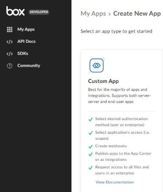
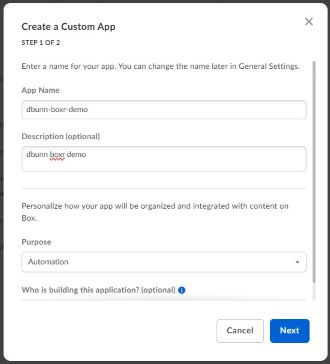
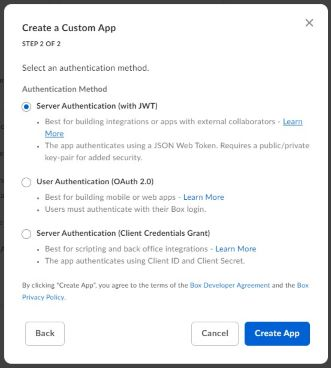
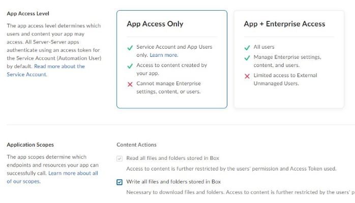
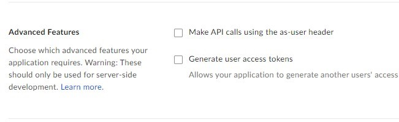
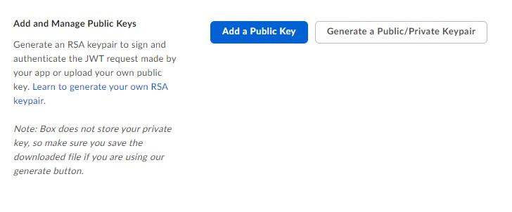
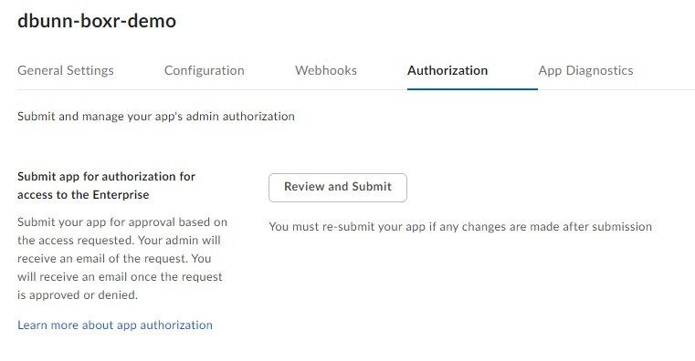
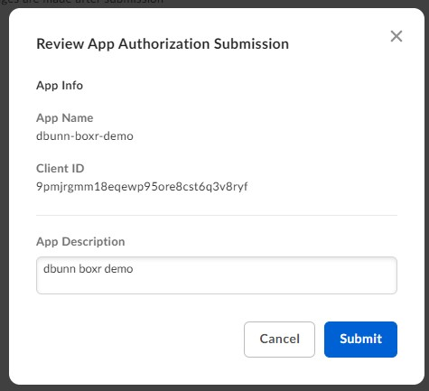
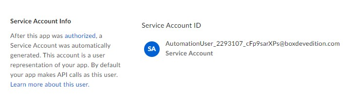
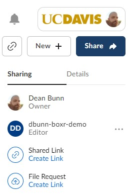

# UCD Boxr Demo

## Required R Environment Setup

```r
#Add Required Libaries for Setup
library("fs")

#Create Auth Token Folder Location
dir_create("~/.boxr-auth", mode = 700)

#Install Required Packages
install.packages("boxr")
install.packages("jose")

```

## Creating Box App Request

1. While logged into your UCD account Box online, go to [Box Developer](https://developer.box.com)
2. Create an account if you don't already have one
3. Click the **Create New App** button
4. Select the **Custom App** option

   

5. Enter a unique and identifying **App Name**  and select a **Purpose** option, click **Next**

   

6. Select **Server Authentication(with JWT)**, click **Create App**

   

7. Under App Access Level, select **App Access Only** and check **Write all files and folder stored in Box** in the Application Scopes. Leave the Administrative and Developer Actions unchecked

   

8. Make sure "Make API calls using the as-user header" and "Generate user access tokens" are unchecked

   

9. This step requires your account have two-factor authentication on your account. In the Add and Manage Public Keys section, click the **Generate a Public/Private Keypair** button. This will download a JSON file via your browser. Rename the file **token.json** and save it in **.boxr-auth** directory

   

10. Click the **Save Changes** button at the top

11. On the **Authorization** tab, click the **Review and Submit** button

    

12. Confirm the submission by clicking **Submit**

    

13. Send an email to ithelp@ucdavis.edu asking for your Box app request to be approved. Please include the name of the account submitting the request

14. Once a Box admin approves the request, on the **General Settings** tab of the app a **Service Account Info** section should appear with the address of the service account

    

15. Add this service account as a collaborator to any Box resources you want your app to manage

    

16. Now you should be ready to connect to Box using the examples listed below


## Boxr Demo Code

```r

#Include Required Libraries
library("boxr")

#Authenticate with the Service Account
#Make Sure Token.json File is Listed in ".boxr-auth" folder
box_auth_service()

#Set the Working Directory to a Specific Box Folder by ID
box_setwd(286566472452)

#List Contents of Box Folder
items <- box_ls(dir_id = box_getwd(), limit = 100, max = Inf, fields = NULL)
for (item in items) {
  print(item$id, quote = FALSE)
  print(item$name, quote = FALSE)
  print(item$size, quote = FALSE)
  print(item$modified_at, quote = FALSE)
  print(item$sha1, quote = FALSE)
  print(item$owned_by$login, quote = FALSE)
  print(" ", quote = FALSE)
}

#Load Local Files Up to Box Folder
box_push(dir_id = box_getwd(),  
         local_dir = "C:\\Campbellsci\\LoggerNet", 
         ignore_dots = TRUE,
         overwrite = FALSE,
         delete = FALSE)

#Read CSV Listed in Box
resrchdata <- box_read_csv(file_id = 1660475682869, header = TRUE)
print(resrchdata)

```


